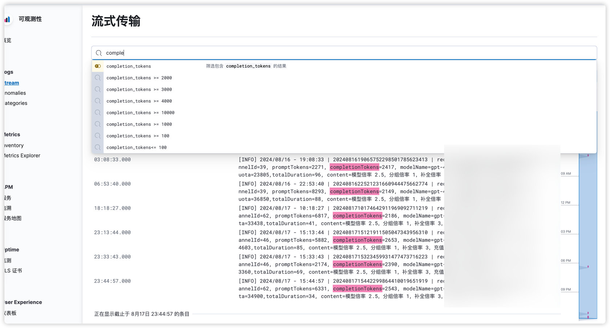
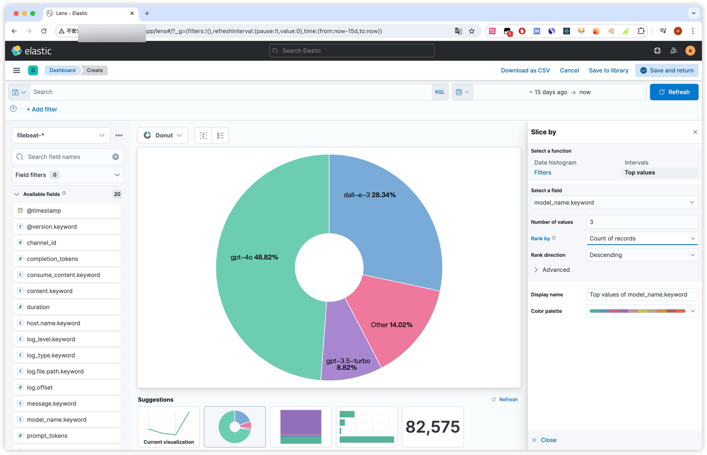

# ShellApiLogOptimizer

ShellApiLogOptimizer 是一款针对 ShellApi 的日志优化插件，可以显著提升查询及统计速度。

## 项目介绍

本插件通过优化日志存储和检索机制，大幅提高了 ShellApi 的日志处理性能。它特别适用于大规模日志数据的快速查询和分析。

## 项目结构

```
ShellApiLogOptimizer/
├── docker-compose/
│   ├── environment/  # ELK基础环境(必需,one-api,new-api也可使用)
│   └── filebeat/     # 日志监控(可选,one-api,new-api也可使用)
└── docker-compose.yml  # ShellApi专用,用于整合log表的结构化数据
```

## 配置要求

- 推荐配置：4核CPU，8GB内存以上；32GB内存以上效果最佳
- 建议使用 docker-compose 进行部署和管理

## 环境准备

在启动前，请确保已安装 Docker 和 Docker Compose。如果您尚未安装，请参考 [Docker 官方文档](https://docs.docker.com/engine/install/centos/)。

## 启动方式

### 使用 Docker Compose

1. 克隆项目代码
   ```shell
   git clone https://github.com/akl7777777/ShellApiLogOptimizer.git
   ```

2. 进入项目根目录
   ```shell
   cd ShellApiLogOptimizer
   ```

3. 启动环境（如果已部署外部 Elasticsearch，可跳过此步骤）
   修改 `docker-compose/environment/docker-compose.yml` 中的 ES 配置，将 ES 地址更改为您的实际地址。
   ```shell
   cd docker-compose/environment
   docker compose up -d
   ```
   环境启动成功后看一眼docker ps进程死了没,死了就看下报错日志,如果报路径无权限建议chmod 777 -R es_data

4. 启动项目
   返回项目根目录并运行：
   ```shell
   docker compose up -d
   ```
   项目将在 8080 端口运行。

### 使用 JAR 包启动

1. 下载最新的 JAR 包
   从 [Releases 页面](https://github.com/akl7777777/ShellApiLogOptimizer/releases) 下载最新的 JAR 文件。

2. 启动 JAR 包
   使用以下命令启动 JAR 包，根据你的需求调整参数：

   ```shell
   java -jar ShellApiLogOptimizer-x.x.x.jar \
   --server.port=8080 \
   --server.servlet.context-path=/shellApiLogOptimizer \
   --easy-es.enable=true \
   --easy-es.address=your_elasticsearch_address:9200 \
   --easy-es.username=your_username \
   --easy-es.password=your_password \
   --api.auth.token=your_api_token
   ```

   请将 `x.x.x` 替换为实际的版本号，并根据你的环境修改以下参数：
   - `server.port`: 应用运行的端口号
   - `server.servlet.context-path`: 应用的上下文路径
   - `easy-es.address`: Elasticsearch 服务器地址
   - `easy-es.username`: Elasticsearch 用户名
   - `easy-es.password`: Elasticsearch 密码
   - `api.auth.token`: API 认证令牌

3. 访问应用
   启动成功后，可以通过 `http://localhost:8080/shellApiLogOptimizer` 访问应用（假设你使用了默认的端口和上下文路径）。

注意：
- 使用 JAR 包启动时，请确保你的环境中已安装了 Java 11 或更高版本。
- 可以根据需要添加或删除命令行参数。
- 为了安全起见，建议在生产环境中使用更复杂的 API 认证令牌。

## 配置项说明

以下是主要配置项的说明，这些配置可以在 `docker-compose.yml` 文件中的 `environment` 部分进行设置，或在使用 JAR 包启动时作为命令行参数提供：

- `SERVER_SERVLET_CONTEXT_PATH` / `server.servlet.context-path`: 应用的上下文路径，默认为 "/shellApiLogOptimizer"
- `API_VERSION` / `api.version`: API 版本，默认为 "service"
- `API_AUTH_TOKEN` / `api.auth.token`: API 认证令牌，用于安全验证
- `EASY_ES_ENABLE` / `easy-es.enable`: 是否启用 Easy-ES，默认为 "true"
- `EASY_ES_ADDRESS` / `easy-es.address`: Elasticsearch 服务器地址，格式为 "host:port"
- `EASY_ES_USERNAME` / `easy-es.username`: Elasticsearch 用户名
- `EASY_ES_PASSWORD` / `easy-es.password`: Elasticsearch 密码

## 效果图

日志条件查询

统计饼图



## 注意事项

- 确保 Elasticsearch 服务正常运行且可访问
- 如使用外部 Elasticsearch，请相应调整 `EASY_ES_ADDRESS`、`EASY_ES_USERNAME` 和 `EASY_ES_PASSWORD`
- 为保证安全，建议修改默认的 `API_AUTH_TOKEN`

## 开发者指南

如果你想要从源码运行或开发这个项目，请按照以下步骤操作：

1. 克隆项目到本地
   ```shell
   git clone https://github.com/akl7777777/ShellApiLogOptimizer.git
   cd ShellApiLogOptimizer
   ```

2. 确保你的开发环境满足以下要求：
   - Java 11 或更高版本
   - Maven 3.6+ 用于依赖管理和构建

3. 配置 Elasticsearch
   确保你有一个可用的 Elasticsearch 实例。你可以使用项目中提供的 Docker Compose 文件来启动一个 Elasticsearch 容器，或者使用已有的 Elasticsearch 服务。

4. 修改配置
   在 `src/main/resources/application.properties` 文件中，根据你的环境修改必要的配置，特别是 Elasticsearch 的连接信息。

5. 构建项目
   ```shell
   mvn clean package
   ```

6. 运行应用
   ```shell
   mvn spring-boot:run
   ```
   或者，你可以使用 IDE 的运行功能来启动 `ShellApiLogOptimizerApplication` 类。

7. 访问应用
   默认情况下，应用将在 `http://localhost:8080/shellApiLogOptimizer` 上运行。

8. 开发和调试
   - 使用你喜欢的 IDE（如 IntelliJ IDEA 或 Eclipse）导入项目。
   - 你可以在 IDE 中设置断点并进行调试。
   - 对代码进行修改后，可以使用 `mvn clean package` 重新构建，或者依赖 IDE 的热重载功能。

9. 运行测试
   ```shell
   mvn test
   ```

10. 提交变更
    在提交你的变更之前，请确保所有测试都能通过，并且你的代码符合项目的编码规范。

如果你在开发过程中遇到任何问题，欢迎提出 issue 或在社区中寻求帮助。

## 贡献

欢迎提交 issues 和 pull requests 来帮助改进这个项目。

## 许可证

本项目采用 GNU Affero General Public License v3.0 (AGPL-3.0) 许可证。

我们欢迎并鼓励所有形式的开源贡献。选择 AGPL 许可证是为了确保任何基于本项目的改进都能回馈到开源社区。这不会影响您贡献代码的能力，但要求任何修改过的版本在通过网络提供服务时也必须开源。

完整的许可证文本可以在项目根目录的 [LICENSE](LICENSE) 文件中找到。


## 日志文件整合到ELK(支持one-api,new-api,shell-api青春版,专业版)

0. 前提:需要提前部署上面的ShellApiLogOptimizer/docker-compose/environment/docker-compose.yml
1. 拷贝docker-compose/filebeat 下面的所有文件到ShellAPI 或者one api new api 项目部署的服务器上
2. 确保将 /path/to/your/logs 替换为你实际的日志文件所在的目录路径，支持同一个机器启动了多个ShellApi,
用system_id进行区别,如果只部署了一个,可以删掉其他多余的配置,your_elk_server_ip 替换为运行 ELK 栈的服务器 IP
3. 启动 Filebeat
```shell
docker-compose up -d
```